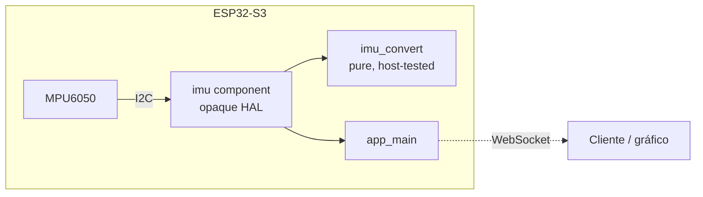

# esp32-imu-bridge

> **Firmware ESP-IDF v6 + FreeRTOS dual-core em C** — aquisição inercial (MPU6050) e streaming WebSocket em edge.

[](https://github.com/abreu0x/esp32-imu-bridge/actions)
[](https://github.com/abreu0x/esp32-imu-bridge/releases)
[](LICENSE)

> **Status:** esqueleto em desenvolvimento. HAL de sensor com **API opaca** e lógica de
> conversão testada em CI (Unity no target Linux, sem hardware). Aquisição I2C real a
> 1 kHz, ring buffer SPSC dual-core e streaming WebSocket chegam nas próximas etapas.

## 🚀 Demo em 30s

```bash
# Build do firmware (ESP32-S3) via imagem oficial ESP-IDF v6 — sem instalar toolchain:
docker run --rm -v "$PWD":/project -w /project espressif/idf:release-v6.0 \
  bash -c '. $IDF_PATH/export.sh && idf.py set-target esp32s3 && idf.py build'

# Testes unitários (Unity nativo, sem hardware):
docker run --rm -v "$PWD":/project -w /project/host_test espressif/idf:release-v6.0 \
  bash -c '. $IDF_PATH/export.sh && idf.py --preview set-target linux && idf.py build && build/*.elf'
```

## 🏗️ Architecture



- **`components/imu_convert`** — conversão raw↔unidades físicas (g, °/s). C puro, **zero deps ESP-IDF**, testada em host.
- **`components/imu`** — HAL do sensor com handle **opaco** (`init`/`start`/`stop`/`get_sample`). Isola o hardware do resto.
- **`main`** — orquestra init + loop de amostragem.

## 🧪 Testes & CI

| Camada | Ferramenta | Onde roda |
|--------|-----------|-----------|
| Unit (lógica pura) | Unity | CI, target Linux (sem hardware) |
| Build firmware | ESP-IDF v6.0 | CI, target esp32s3 |
| HAL mock (S4) | CMock | _planejado_ |
| Suite em QEMU (S6) | Unity + QEMU Xtensa | _planejado_ |

## 🗺️ Roadmap

- [x] Esqueleto: componente opaco + conversão testada + CI verde
- [ ] I2C real: probe `WHO_AM_I`, wake `PWR_MGMT_1`, burst-read 14 bytes @ 1 kHz
- [ ] Task core-0 com hardware timer + ring buffer SPSC
- [ ] Streaming WebSocket (lwIP core-1) + benchmark de jitter (medido, não prometido)
- [ ] CMock no HAL I2C · QEMU Xtensa em CI · fuzz no parser WS

## 🛠️ Stack

ESP-IDF v6.0 · FreeRTOS 11.3 · C11 · I2C · MPU6050 · WebSocket (lwIP) · Unity · esp_timer

## 📄 Licença

MIT — ver [LICENSE](LICENSE).
